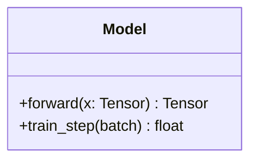
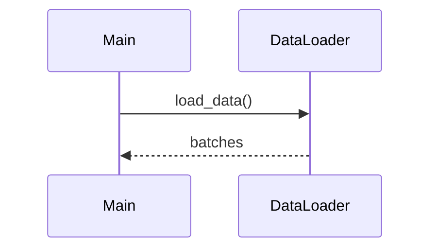

# Algorithm Design

Formalize methods into algorithm pseudocode and system architecture diagrams.

## Input

- `$0` — Method description or implementation to formalize

## References

- Algorithm and diagram templates: `~/.claude/skills/algorithm-design/references/algorithm-templates.md`

## Workflow

### Step 1: Formalize the Algorithm
1. Define clear inputs and outputs
2. Identify the main loop / recursive structure
3. Specify all parameters and their types
4. Write step-by-step pseudocode

### Step 2: Generate LaTeX Pseudocode
Use `algorithm` + `algpseudocode` environments:
```latex
\begin{algorithm}[t]
\caption{Method Name}
\label{alg:method}
\begin{algorithmic}[1]
\Require Input $x$, parameters $\theta$
\Ensure Output $y$
\State Initialize ...
\For{$t = 1$ to $T$}
    \State $z_t \gets f(x_t; \theta)$
    \If{convergence criterion met}
        \State \textbf{break}
    \EndIf
\EndFor
\State \Return $y$
\end{algorithmic}
\end{algorithm}
```

### Step 3: Generate UML Diagrams (Mermaid)

#### Class Diagram


#### Sequence Diagram


### Step 4: Verify Consistency
- Every pseudocode step must map to a code module
- Every class in the UML must exist in the implementation
- Parameter names must match between pseudocode and code

## Rules

- Use standard algorithmic notation (not code syntax)
- Number lines for easy reference
- Include complexity analysis as a comment or proposition
- Use `\Require` / `\Ensure` for inputs/outputs
- Keep pseudocode at the right abstraction level — not too detailed, not too vague

## Related Skills
- Upstream: [atomic-decomposition](../atomic-decomposition/), [math-reasoning](../math-reasoning/)
- Downstream: [experiment-code](../experiment-code/), [paper-writing-section](../paper-writing-section/)
- See also: [symbolic-equation](../symbolic-equation/)
