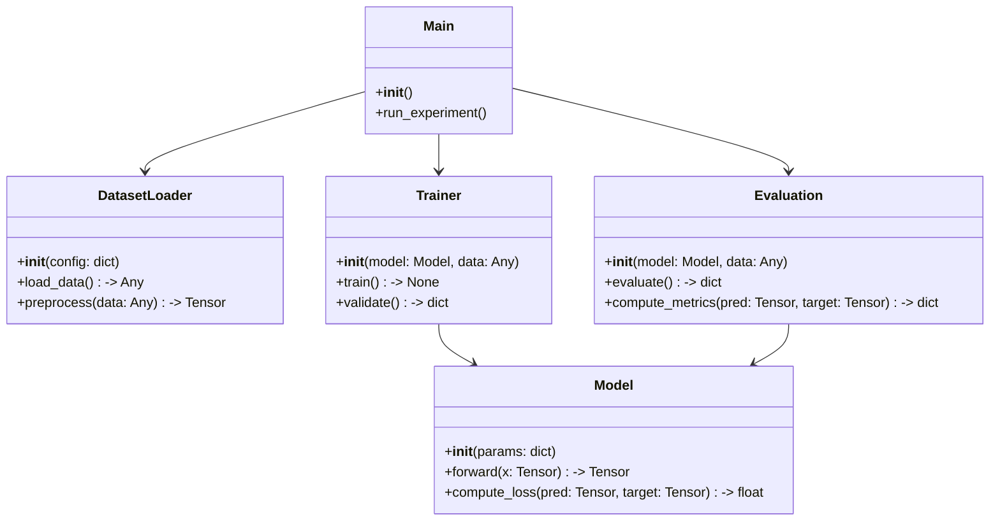
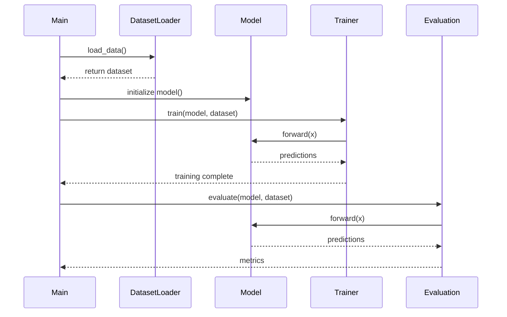
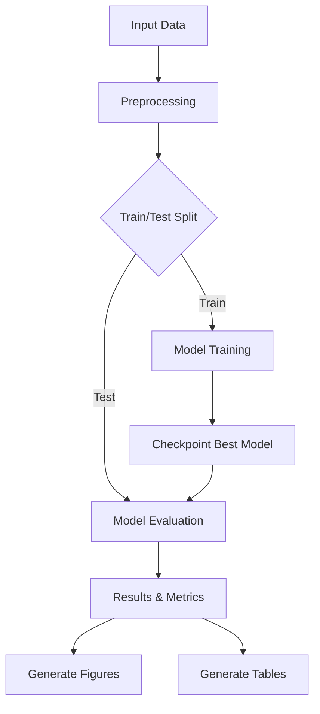

# Algorithm Design Templates

Extracted from Paper2Code (planning stage) and AI-Researcher (plan_agent).

## LaTeX Algorithm Templates

### Basic Algorithm with Loop
```latex
\begin{algorithm}[t]
\caption{Algorithm Name}
\label{alg:name}
\begin{algorithmic}[1]
\Require Input data $\mathcal{D} = \{(x_i, y_i)\}_{i=1}^N$, learning rate $\eta$, epochs $T$
\Ensure Trained model parameters $\theta^*$
\State Initialize $\theta \sim \mathcal{N}(0, \sigma^2)$
\For{$t = 1$ to $T$}
    \For{each mini-batch $\mathcal{B} \subset \mathcal{D}$}
        \State $\mathcal{L} \gets \frac{1}{|\mathcal{B}|} \sum_{(x,y) \in \mathcal{B}} \ell(f_\theta(x), y)$
        \State $\theta \gets \theta - \eta \nabla_\theta \mathcal{L}$
    \EndFor
    \If{convergence criterion met}
        \State \textbf{break}
    \EndIf
\EndFor
\State \Return $\theta^* \gets \theta$
\end{algorithmic}
\end{algorithm}
```

### Algorithm with Subroutine Call
```latex
\begin{algorithm}[t]
\caption{Main Algorithm}
\label{alg:main}
\begin{algorithmic}[1]
\Require Input $x$, model $f_\theta$
\Ensure Prediction $\hat{y}$
\State $z \gets \textsc{Encode}(x)$ \Comment{See Algorithm~\ref{alg:encode}}
\State $\hat{y} \gets \textsc{Decode}(z)$
\State \Return $\hat{y}$
\end{algorithmic}
\end{algorithm}
```

### Algorithm with While Loop and Convergence
```latex
\begin{algorithm}[t]
\caption{Iterative Optimization}
\label{alg:optimize}
\begin{algorithmic}[1]
\Require Initial solution $x_0$, tolerance $\epsilon$
\Ensure Optimal solution $x^*$
\State $k \gets 0$
\While{$\|x_{k+1} - x_k\| > \epsilon$}
    \State $g_k \gets \nabla f(x_k)$
    \State $\alpha_k \gets \textsc{LineSearch}(x_k, g_k)$
    \State $x_{k+1} \gets x_k - \alpha_k g_k$
    \State $k \gets k + 1$
\EndWhile
\State \Return $x^* \gets x_k$
\end{algorithmic}
\end{algorithm}
```

## Mermaid UML Templates

### Class Diagram (from Paper2Code)


### Sequence Diagram (from Paper2Code)


### Flowchart for Method Pipeline


## Complexity Analysis Template

```latex
\begin{proposition}[Computational Complexity]
\label{prop:complexity}
Algorithm~\ref{alg:name} has time complexity $O(NTd)$ and space complexity $O(Nd)$,
where $N$ is the number of samples, $T$ is the number of epochs, and $d$ is the
feature dimension.
\end{proposition}

\begin{proof}
The outer loop runs $T$ iterations. In each iteration, we process all $N$ samples.
For each sample, the forward pass requires $O(d)$ operations...
\end{proof}
```

## Required LaTeX Packages

```latex
\usepackage{algorithm}
\usepackage{algorithmicx}
\usepackage{algpseudocode}
% For \textsc command in algorithms:
\usepackage{textcomp}
```

## Consistency Checklist

```
Verify algorithm-code consistency:
[ ] Every pseudocode step maps to a code function/method
[ ] Every class in UML exists in implementation
[ ] Parameter names match between pseudocode and code
[ ] Input/output types match between diagram and code
[ ] Loop structures match between algorithm and code
[ ] Subroutine calls in algorithm reference actual functions
```
