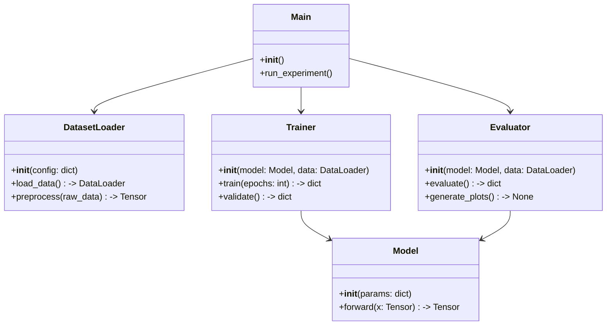
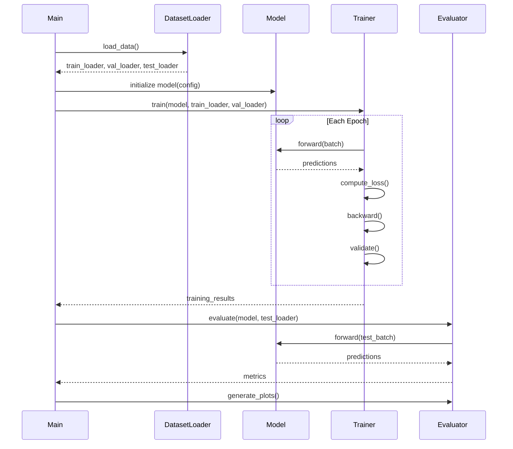

# Research Planning Output Schemas

## Complete Research Plan Schema

```json
{
  "research_question": "What is the core research question?",
  "significance": "Why does this matter?",
  "methodology": {
    "approach": "High-level approach description",
    "key_techniques": ["technique1", "technique2"],
    "assumptions": ["assumption1", "assumption2"]
  },
  "paper_structure": {
    "sections": [
      {
        "name": "Abstract",
        "key_points": ["TL;DR", "contribution", "key result"],
        "target_words": 250
      },
      {
        "name": "Introduction",
        "key_points": ["motivation", "problem statement", "contributions"],
        "target_words": 800,
        "figures": ["fig:teaser"]
      },
      {
        "name": "Background",
        "key_points": ["problem formalization", "notation", "prerequisites"],
        "target_words": 500
      },
      {
        "name": "Related Work",
        "key_points": ["theme1: ...", "theme2: ...", "positioning"],
        "target_words": 600
      },
      {
        "name": "Methods",
        "key_points": ["algorithm description", "theoretical analysis"],
        "target_words": 1200,
        "figures": ["fig:architecture"],
        "equations": ["objective function", "update rule"]
      },
      {
        "name": "Experiments",
        "key_points": ["setup", "baselines", "main results", "ablations"],
        "target_words": 1500,
        "tables": ["tab:main_results", "tab:ablation"],
        "figures": ["fig:training_curves", "fig:comparison"]
      },
      {
        "name": "Conclusion",
        "key_points": ["summary", "limitations", "future work"],
        "target_words": 400
      }
    ]
  },
  "implementation": {
    "file_list": ["main.py", "model.py", "trainer.py", "evaluate.py"],
    "class_diagram": "classDiagram\n  class Model { ... }\n  ...",
    "sequence_diagram": "sequenceDiagram\n  ...",
    "required_packages": ["torch>=2.0", "numpy", "matplotlib"]
  },
  "task_list": [
    {
      "id": 1,
      "task": "Implement data loading pipeline",
      "depends_on": [],
      "priority": "high",
      "estimated_complexity": "low"
    },
    {
      "id": 2,
      "task": "Implement model architecture",
      "depends_on": [1],
      "priority": "high",
      "estimated_complexity": "medium"
    },
    {
      "id": 3,
      "task": "Implement training loop",
      "depends_on": [1, 2],
      "priority": "high",
      "estimated_complexity": "medium"
    },
    {
      "id": 4,
      "task": "Run baseline experiments",
      "depends_on": [3],
      "priority": "high",
      "estimated_complexity": "low"
    },
    {
      "id": 5,
      "task": "Run ablation studies",
      "depends_on": [4],
      "priority": "medium",
      "estimated_complexity": "medium"
    },
    {
      "id": 6,
      "task": "Generate figures and tables",
      "depends_on": [4, 5],
      "priority": "medium",
      "estimated_complexity": "low"
    },
    {
      "id": 7,
      "task": "Write paper",
      "depends_on": [6],
      "priority": "high",
      "estimated_complexity": "high"
    }
  ],
  "experiment_design": {
    "baselines": ["Baseline1", "Baseline2"],
    "datasets": ["Dataset1", "Dataset2"],
    "evaluation_metrics": ["accuracy", "F1", "inference_time"],
    "hyperparameters": {
      "learning_rate": 0.001,
      "batch_size": 64,
      "epochs": 100
    },
    "ablation_components": ["component_A", "component_B", "component_C"],
    "num_seeds": 3
  },
  "risks": [
    {
      "risk": "Method may not scale to large datasets",
      "mitigation": "Start with small-scale experiments, profile memory usage",
      "severity": "medium"
    }
  ]
}
```

## Mermaid Diagram Templates

### Class Diagram


### Sequence Diagram

